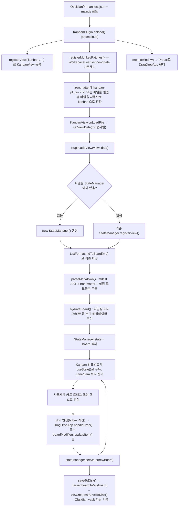

---
tags:
  - obsidian-plugin
  - developer-doc
---

# Obsidian Kanban Plugin — 개발자 가이드

> [!info] 이 문서는
> `obsidian-kanban` 플러그인의 **초기 설정 → 실행 순서 → 폴더/파일별 역할**을 개발자 관점에서 정리한 문서입니다. 코드를 처음 열어보는 사람이 위에서 아래로 읽으면 "빌드가 어떻게 되고", "플러그인이 어떻게 켜지고", "마크다운이 어떻게 칸반보드가 되는지"를 순서대로 이해할 수 있도록 구성했습니다.

## 목차

- [[#1. 프로젝트 개요]]
- [[#2. 기술 스택]]
- [[#3. 개발 환경 설정 (빌드·실행)]]
- [[#4. 실행 흐름 — 엔트리 포인트부터 순차적으로]]
- [[#5. 폴더·파일 구조 상세]]
- [[#6. 핵심 데이터 모델]]
- [[#7. 마크다운 ↔ 보드 변환 파이프라인]]
- [[#8. 자체 구현 Drag & Drop 시스템 (src-dnd)]]
- [[#9. StateManager — 상태 관리 패턴]]
- [[#10. 설정(Settings) 시스템]]
- [[#11. 다국어(i18n) 시스템]]
- [[#12. 코드 스타일 & 문법 컨벤션]]
- [[#13. 빌드 산출물과 배포]]
- [[#14. 개발 팁 & 주의사항]]

---

## 1. 프로젝트 개요

`obsidian-kanban`은 [Obsidian](https://obsidian.md) 노트 안에 **마크다운으로 저장되는 칸반보드**를 만들어주는 커뮤니티 플러그인입니다.

- 보드의 실체는 `.md` 파일 하나입니다. 리스트(Lane)는 `##` 헤딩, 카드(Item)는 체크리스트 항목(`- [ ] ...`)으로 표현되며, 이 파일을 일반 마크다운 에디터로 열어도 내용을 읽고 편집할 수 있습니다.
- frontmatter의 `kanban-plugin` 키(`board` / `table` / `list`)로 "이 파일은 칸반보드다"라는 것과 보기 방식을 표시합니다.
- 플러그인은 이 파일을 파싱해 `Board` 객체(자료구조)로 만들고, Preact 기반 UI로 렌더링하며, 사용자가 드래그·편집을 하면 다시 마크다운으로 직렬화해 디스크에 저장합니다.

> [!warning] 유지보수 상태
> [[MAINTAINERS.md]]에 명시되어 있듯, 원 개발자는 신규 메인테이너를 구하는 중이며 "코드가 군데군데 지저분하고, 복잡한 부분은 LLM이 잘 다루지 못할 수 있다"고 직접 경고하고 있습니다. 이 문서를 참고해 구조를 먼저 파악한 뒤 코드를 수정하는 것을 권장합니다.

---

## 2. 기술 스택

| 영역 | 사용 기술 | 비고 |
|---|---|---|
| 언어 | **TypeScript** 5.x | `tsconfig.json`: `target: es2018`, `module: ESNext`, `strict`한 `noImplicitAny` |
| UI 프레임워크 | **Preact 10** (`preact/compat`) | `package.json`에서 `react`, `react-dom` 패키지를 `npm:@preact/compat`으로 **별칭(alias) 처리** → 코드에서는 `react`처럼 보이지만 실제로는 Preact가 동작 |
| JSX | `jsx: react-jsx`, `jsxImportSource: preact` | React 17+ 방식의 자동 JSX 런타임을 Preact가 대신 제공 |
| 번들러 | **esbuild** (`esbuild.config.mjs`) | Rollup/Webpack 설정 없이 esbuild 스크립트를 직접 작성해 사용 |
| 스타일 | **Less** (`src/styles.less` → `styles.css`) | `esbuild-plugin-less`로 컴파일, 커스텀 플러그인으로 결과 파일명을 `styles.css`로 변경 |
| 마크다운 파싱 | `mdast-util-from-markdown` + `micromark` 확장 | unified/remark 생태계의 저수준 파서를 직접 사용해 AST를 만들고, 날짜·시간·태그·위키링크용 **커스텀 micromark 확장**을 추가 구현 (`src/parsers/extensions`) |
| 불변 상태 갱신 | `immutability-helper` | `update(obj, { path: { $set: ... } })` 형태의 스펙 문법으로 상태를 변경 |
| 드래그 앤 드롭 | **자체 구현** (`src/dnd`) | `react-beautiful-dnd` 같은 외부 라이브러리 대신 hitbox 좌표 계산 기반의 자체 DnD 엔진을 사용 (Preact/팝아웃 윈도우 지원 때문) |
| 이벤트 버스 | `eventemitter3` | `KanbanView.emitter`로 컴포넌트 ↔ 뷰 간 커맨드/단축키 전달 |
| 날짜/시간 | Obsidian 내장 `moment` | 카드의 `@{날짜}`, `@@{시간}` 트리거 파싱에 사용 |
| 인라인 에디터 | **CodeMirror 6** (`@codemirror/state`, `view`, `commands`) | 카드 제목을 인라인으로 편집할 때 Obsidian의 실제 마크다운 에디터 클래스를 재사용 |
| 날짜 선택 UI | 자체 포크된 **flatpickr** (`src/components/Editor/flatpickr`) | 원본 라이브러리를 vendoring하여 프로젝트에 포함 |
| 테이블 뷰 | `@tanstack/react-table` | `table` 보기 모드에서 사용 |
| 린트 | ESLint + `@typescript-eslint` + `eslint-plugin-react` | `.eslintrc.js` |
| 포맷 | Prettier + `@trivago/prettier-plugin-sort-imports` | `prettier.config.cjs`, import 문 자동 정렬 |
| 다국어 | 자체 구현 (`src/lang`) | 25개 이상 로케일, Obsidian의 언어 설정을 `localStorage`에서 읽어 적용 |

---

## 3. 개발 환경 설정 (빌드·실행)

### 3.1 사전 준비

```bash
# 의존성 설치 (yarn 또는 npm)
yarn install
```

### 3.2 주요 스크립트 (`package.json`)

| 스크립트 | 명령 | 설명 |
|---|---|---|
| `yarn dev` | `node esbuild.config.mjs` | esbuild **watch 모드**. 소스 변경 시 자동으로 `main.js`/`styles.css` 재생성 |
| `yarn build` | `node esbuild.config.mjs production` | 프로덕션 빌드 (minify, sourcemap 제거) |
| `yarn typecheck` | `tsc --noemit` | 타입 검사만 수행 (번들링 없음) |
| `yarn lint` / `lint:fix` | `eslint ./src/**/*.{ts,tsx}` | 린트 검사/자동 수정 |
| `yarn prettier` | `prettier --write ...` | 코드 포맷팅 |
| `yarn bump` | `version-bump.mjs` 실행 | `package.json` 버전을 `manifest.json`/`versions.json`에 반영 |

> [!tip] 이 저장소 자체가 테스트 vault의 플러그인 폴더입니다
> 이 프로젝트 경로가 이미 `.../plugin_dev_playground/.obsidian/plugins/obsidian-kanban`인 것에서 알 수 있듯, 이 저장소는 별도 배포 없이 **바로 Obsidian이 로드하는 플러그인 폴더** 안에서 개발됩니다. 즉:
> 1. `yarn dev`를 백그라운드로 켜둔다.
> 2. 소스를 수정하면 esbuild가 루트의 `main.js`/`styles.css`를 다시 만든다.
> 3. Obsidian에서 `Ctrl/Cmd+R` (Reload app without saving) 또는 플러그인 토글 껐다 켜기로 변경 사항을 반영한다.

### 3.3 esbuild 설정 요약 (`esbuild.config.mjs`)

- **엔트리포인트**: `src/main.ts`, `src/styles.less`
- **출력**: 저장소 루트(`outdir: './'`) → `main.js`, `styles.css` (Obsidian이 플러그인 폴더에서 바로 읽는 파일들)
- `external`: `obsidian`, `electron`, CodeMirror6 관련 패키지 등은 번들에 포함하지 않고 Obsidian 런타임이 제공하는 것을 그대로 사용
- `NodeModulesPolyfillPlugin`: Node 전용 모듈(`buffer` 등)을 브라우저 환경(Electron 렌더러)에서도 동작하도록 폴리필 처리
- `replace(...)` 플러그인: `node_modules` 내부 코드의 `setTimeout`/`requestAnimationFrame` 등을 `activeWindow.setTimeout` 등으로 치환 → Obsidian의 **팝아웃 윈도우(멀티 윈도우)** 환경에서도 타이머가 올바른 윈도우에 걸리도록 함
- `format: 'cjs'`, `target: 'es2018'`

### 3.4 기타 설정 파일

- [[tsconfig.json]] — `paths`로 `react`/`react-dom`을 `preact/compat`으로 매핑(빌드 시 alias는 `package.json`에서, 타입 체크 시 alias는 여기서 처리)
- [[.eslintrc.js]] — `src/docs`는 린트 제외, TypeScript + React 규칙 적용
- [[prettier.config.cjs]] — 세미콜론 사용, 싱글쿼트, `importOrder: ['^[./]']`로 상대경로 import를 뒤로 정렬
- `.vscode/settings.json` — 저장 시 Prettier 자동 포맷 활성화

---

## 4. 실행 흐름 — 엔트리 포인트부터 순차적으로

가장 중요한 섹션입니다. **플러그인이 켜지는 순간부터 카드 하나를 드래그해서 저장하기까지**의 흐름을 순서대로 설명합니다.



### 단계별 설명

1. **플러그인 로드** — Obsidian이 `manifest.json`을 읽고 `main.js`(esbuild 산출물, 엔트리는 [[src/main.ts]])를 로드해 `KanbanPlugin` 클래스를 인스턴스화합니다.

2. **`KanbanPlugin.onload()`** ([[src/main.ts]])
   - `loadSettings()` — 저장된 플러그인 전역 설정(`data.json`)을 불러옵니다.
   - `getEditorClass(app)` — Obsidian 내부의 마크다운 임베드로부터 **실제 에디터 클래스**를 런타임에 추출합니다. 이렇게 얻은 `MarkdownEditor` 클래스를 카드 제목의 인라인 편집기([[src/components/Editor/MarkdownEditor.tsx]])에서 그대로 재사용해, Obsidian 표준 에디터와 100% 동일한 편집 경험(단축키, 자동완성 등)을 제공합니다.
   - `DateSuggest`/`TimeSuggest` 등록 — 카드 본문에서 `@{`, `@@{` 입력 시 날짜/시간 자동완성을 제공.
   - `window-open` / `window-close` 이벤트 등록 — Obsidian의 **팝아웃 윈도우**마다 독립적인 Preact 렌더 루트를 관리하기 위함.
   - `KanbanSettingsTab` 등록, `registerView(kanbanViewType, ...)`로 `KanbanView` 뷰 팩토리 등록.
   - `registerMonkeyPatches()` — [monkey-around](https://github.com/pjeby/monkey-around) 라이브러리로 `WorkspaceLeaf.prototype.setViewState`를 가로채, 열리는 마크다운 파일의 frontmatter에 `kanban-plugin` 키가 있으면 **자동으로 뷰 타입을 `kanban`으로 강제 전환**합니다. `detach`도 패치해 파일별 "마크다운으로 보기/칸반으로 보기" 모드(`kanbanFileModes`)를 정리합니다.
   - `registerCommands()` — 커맨드 팔레트 명령(새 보드 생성, 완료 카드 아카이브, 보기 전환 등) 등록.
   - `registerEvents()` — 우클릭 메뉴 항목, 파일 rename 추적, vault의 `modify`/`metadataCache changed`/dataview 이벤트 구독(외부에서 파일이 바뀌면 보드를 재동기화하기 위함).
   - `mount(window)` — 메인 윈도우에 빈 `<div>`를 만들고 그 위에 Preact로 [[src/DragDropApp.tsx]]를 렌더합니다. 이 시점에는 아직 열린 칸반 뷰가 없으므로 포탈 없이 빈 상태입니다.

3. **칸반 파일 열기** — 사용자가 `kanban-plugin: board` frontmatter가 있는 `.md` 파일을 클릭하면, 2단계의 몽키패치가 뷰 타입을 `kanban`으로 바꾸고 Obsidian이 `KanbanView`([[src/KanbanView.tsx]])를 생성합니다. `KanbanView`는 Obsidian의 `TextFileView`를 상속하며:
   - `onLoadFile()` → 부모 클래스가 파일 내용을 읽어 `setViewData(data)`를 호출합니다.
   - `setViewData()`에서 frontmatter에 `kanban-plugin` 키가 없으면(예: 사용자가 키를 지운 경우) 다시 일반 마크다운 뷰로 되돌리고, 있으면 `plugin.addView(this, data, ...)`을 호출합니다.

4. **`KanbanPlugin.addView()`** — 해당 파일에 대한 `StateManager`가 이미 있으면(다른 탭/팝아웃에서 이미 열려있음) 그 인스턴스에 뷰만 등록(`registerView`)하고, 없으면 **파일 하나당 하나씩** 새 `StateManager`([[src/StateManager.ts]])를 생성합니다. 즉 **같은 보드를 여러 창에 띄워도 상태(Board 객체)는 단일 소스**입니다.

5. **최초 파싱** — `StateManager` 생성자가 `ListFormat`(파서, [[src/parsers/List.ts]])을 만들고 `registerView()` → `newBoard(view, md)` → `getParsedBoard(md)` → `parser.mdToBoard(md)`를 호출합니다. 자세한 내용은 [[#7. 마크다운 ↔ 보드 변환 파이프라인]] 참고. 결과물은 `Board` 객체이며 `this.state`에 저장됩니다.

6. **렌더링** — `KanbanView.getPortal()`이 `<Kanban stateManager={...} view={this} />`를 반환하고, [[src/DragDropApp.tsx]]가 열려있는 모든 `KanbanView`를 `createPortal()`로 각 뷰의 `contentEl`에 이식합니다. [[src/components/Kanban.tsx]] 내부에서 `stateManager.useState()`로 Board를 구독하고, `Lanes` → `Lane` → `Item` 컴포넌트 트리로 렌더합니다.

7. **사용자 조작(드래그/편집)** — 드래그는 자체 DnD 엔진([[#8. 자체 구현 Drag & Drop 시스템 (src-dnd)]])이 처리해 [[src/DragDropApp.tsx]]의 `handleDrop` 콜백을 호출하고, 텍스트 편집·체크박스 토글 등은 [[src/helpers/boardModifiers.ts]]의 `BoardModifiers` 함수들을 통해 이루어집니다. 두 경로 모두 최종적으로 `stateManager.setState(newBoard)`를 호출합니다.

8. **상태 반영 및 저장** — `StateManager.setState()`는 (a) 구독 중인 모든 React state에 새 Board를 전파하고 (b) `saveToDisk()`를 호출합니다. `saveToDisk()`는 `parser.boardToMd(state)`로 Board 객체를 다시 마크다운 문자열로 직렬화한 뒤 `view.requestSaveToDisk()` → Obsidian의 `requestSave()`를 통해 실제 vault 파일에 기록합니다.

9. **외부 변경 감지** — 다른 곳(다른 기기의 동기화, 다른 플러그인 등)에서 파일이 바뀌면 3단계에서 등록한 `vault.modify`/`metadataCache changed` 이벤트가 `StateManager.onFileMetadataChange()` → `reparseBoardFromMd()`를 호출해 보드를 재파싱·재동기화합니다.

---

## 5. 폴더·파일 구조 상세

### 5.1 저장소 루트

| 경로 | 역할 |
|---|---|
| `manifest.json` | Obsidian 플러그인 메타데이터(id, 버전, 최소 앱 버전 등) |
| `package.json` | npm 스크립트·의존성. `react`/`react-dom` → Preact alias가 핵심 포인트 |
| `esbuild.config.mjs` | 커스텀 esbuild 빌드 스크립트 (dev/production 겸용) |
| `main.js` / `styles.css` | **빌드 산출물**. Obsidian이 실제로 로드하는 파일 (직접 수정 금지, `src/`를 고쳐야 함) |
| `tsconfig.json` | TypeScript 컴파일러 옵션, Preact 타입 alias |
| `.eslintrc.js` / `prettier.config.cjs` | 정적 분석/포맷 규칙 |
| `version-bump.mjs`, `versions.json` | `yarn bump` 시 버전 동기화 |
| `.github/workflows/release.yml` | 태그 push 시 GitHub Release 자동 생성(빌드 후 `main.js`/`manifest.json`/`styles.css` 첨부) |
| `docs/` | **개발 문서 아님** — Obsidian Publish로 게시되는 *사용자용* 플러그인 사용법 문서 vault |
| `buffer-es6.mjs`, `preact-shim.js` | esbuild 빌드 시 필요한 Node polyfill/alias 보조 파일 |

### 5.2 `src/` 최상위 파일

| 파일 | 역할 |
|---|---|
| [[src/main.ts]] | **엔트리 포인트.** `KanbanPlugin` 클래스 — 플러그인 생명주기, 커맨드/이벤트/뷰 등록 |
| [[src/KanbanView.tsx]] | Obsidian `TextFileView`를 상속한 칸반 뷰. 파일 로드/저장, 헤더 액션 버튼, 보드 설정 모달 담당 |
| [[src/StateManager.ts]] | 파일(보드) 하나당 하나씩 존재하는 **상태 저장소**. 파싱, 저장, pub/sub 구독 관리 |
| [[src/DragDropApp.tsx]] | 윈도우(창)당 하나씩 마운트되는 최상위 Preact 앱. 모든 `KanbanView`를 포탈로 이식하고 전역 드롭 핸들러(`handleDrop`)를 정의 |
| [[src/Settings.ts]] | 플러그인 설정 타입(`KanbanSettings`) 정의 + 설정 탭 UI + 보드 설정 모달 |
| [[src/settingHelpers.ts]] | 설정 UI에서 쓰는 공용 헬퍼(검색 가능한 셀렉트박스 등), 기본 트리거 문자 상수 |
| `src/styles.less` | 플러그인 전체 스타일(Less) |
| `src/types.d.ts` | Preact JSX 타입 보강(ARIA 속성 등 전역 타입 선언) |
| [[src/helpers.ts]] | 데일리노트 이동, frontmatter 키 검사 등 잡다한 최상위 헬퍼 |

### 5.3 `src/components/` — UI 컴포넌트 (Preact)

| 경로 | 역할 |
|---|---|
| [[src/components/Kanban.tsx]] | 보드 최상위 컴포넌트. 검색, 레인 목록, 보기 모드(board/table/list) 분기 |
| `Lane/` | 리스트(레인) 관련: `Lane.tsx`(본체), `LaneHeader.tsx`, `LaneForm.tsx`(새 레인 추가/이름 편집), `LaneMenu.tsx`, `LaneSettings.tsx` |
| `Item/` | 카드 관련: `Item.tsx`(본체), `ItemContent.tsx`, `ItemForm.tsx`(편집 폼), `ItemCheckbox.tsx`, `ItemMenu.ts`, `MetadataTable.tsx`(파일 메타데이터 표시), `DateAndTime.tsx`, `InlineMetadata.tsx` |
| `Editor/` | 카드 제목 인라인 편집기. `MarkdownEditor.tsx`(CodeMirror6 래퍼), `suggest.ts`(날짜/시간 자동완성), `dateWidget.ts`/`datepicker.ts`(날짜 위젯), `flatpickr/`(벤더링된 날짜선택 라이브러리) |
| `Table/` | `table` 보기 모드. `@tanstack/react-table` 기반 `Table.tsx`, `Cells.tsx` |
| `MarkdownRenderer/` | 카드 본문을 Obsidian 표준 방식으로 렌더링하는 `BasicMarkdownRenderer` |
| `Icon/` | Lucide 아이콘 래퍼 컴포넌트 |
| `context.ts` | `KanbanContext`(뷰/stateManager/boardModifiers), `SearchContext`, `SortContext` 등 Preact Context 정의 |
| `helpers.ts` | `c()`(CSS 클래스명 헬퍼, BEM 스타일), `generateInstanceId`, 검색 값 계산, 완료 처리 로직 등 |
| `types.ts` | **핵심 데이터 모델** — `Board`/`Lane`/`Item`/설정 타입들 (자세히는 [[#6. 핵심 데이터 모델]]) |

### 5.4 `src/dnd/` — 자체 Drag & Drop 엔진

자세한 설명은 [[#8. 자체 구현 Drag & Drop 시스템 (src-dnd)]] 참고.

| 경로 | 역할 |
|---|---|
| `managers/DndManager.ts` | 창(Window) 단위 DnD 컨텍스트. hitbox/scroll 엔티티 등록소, 리사이즈 감시 |
| `managers/DragManager.ts` | 실제 마우스/터치 드래그 이벤트 처리, 어떤 엔티티 위에 있는지 계산 |
| `managers/EntityManager.ts` | 개별 드래그 가능 요소(hitbox)의 등록/해제 |
| `managers/ScrollManager.ts` / `ScrollStateManager.ts` | 드래그 중 자동 스크롤, 스크롤 위치 추적 |
| `managers/SortManager.ts` | 정렬 가능한 리스트 내에서의 순서 계산 |
| `components/` | `DndContext`, `Droppable`, `Sortable`, `DragOverlay`(드래그 중 마우스를 따라다니는 프리뷰), `ScrollContainer` 등 |
| `util/data.ts` | `Board` 트리(경로 기반)에 대한 불변 조작 함수: `getEntityFromPath`, `insertEntity`, `removeEntity`, `moveEntity`, `updateEntity` — **DnD 결과를 실제 데이터 모델에 반영하는 핵심 유틸** |
| `util/hitbox.ts` | 좌표/사각형 충돌 계산 |
| `types.ts` | `Nestable<D, T>`(트리 구조 기본형), `Entity`, `Path` 등 DnD 전역 타입 |

### 5.5 `src/parsers/` — 마크다운 ↔ 보드 변환

자세한 설명은 [[#7. 마크다운 ↔ 보드 변환 파이프라인]] 참고.

| 경로 | 역할 |
|---|---|
| [[src/parsers/common.ts]] | `frontmatterKey`("kanban-plugin") 상수, `BaseFormat` 인터페이스, 검색어 생성, 파일 메타데이터(frontmatter/Dataview) 조회 |
| [[src/parsers/parseMarkdown.ts]] | frontmatter YAML 추출, 파일 하단 설정 코드블록 추출, `mdast-util-from-markdown`으로 AST 생성 |
| [[src/parsers/List.ts]] | `BaseFormat`의 리스트 기반 구현체(`ListFormat`) — 현재 유일한 보드 저장 포맷 |
| `formats/list.ts` | AST → Board 변환(`astToUnhydratedBoard`), Board → 마크다운 직렬화(`boardToMd`) 실구현 |
| `extensions/` | 커스텀 micromark 확장: `genericWrapped`(날짜/시간/위키링크처럼 `트리거+구분자`로 감싸인 토큰), `tag.ts`(`#태그`), `blockid.ts`(`^블록ID`), `taskList.ts`(GFM 체크박스), `internalMarkdownLink.ts`(`[텍스트](파일.md)` 형태 링크) |
| `helpers/hydrateBoard.ts` | 파싱 직후의 "날 것" Board에 파일 링크 해석, 태그/날짜 파싱 결과, `metadata-keys` 설정에 따른 연결 노트 메타데이터 등을 채워 넣는 후처리(hydration) |
| `helpers/inlineMetadata.ts` | 카드 본문의 인라인 필드(`[key:: value]`), 체크박스 완료 문자(`getTaskStatusDone` 등), 태스크 토글 로직 |
| `helpers/parser.ts`, `helpers/ast.ts` | mdast 노드 순회/변환 보조 유틸 |

### 5.6 `src/helpers/` (최상위와 다른, 보드 조작용)

| 파일 | 역할 |
|---|---|
| [[src/helpers/boardModifiers.ts]] | `BoardModifiers` — 카드/레인 추가·삭제·이동·아카이브 등 **UI에서 호출하는 보드 조작 API**. 내부적으로 `dnd/util/data.ts`와 `immutability-helper`를 사용 |
| [[src/helpers/patch.ts]] | 두 Board 객체 간의 JSON-patch 스타일 diff/apply(`diff`, `diffApply`) — 재파싱 시 기존 상태(예: 접힘 상태, DOM 참조)를 최대한 보존하기 위해 사용 |
| [[src/helpers/renderMarkdown.ts]] | 위키링크 경로 정규화(`getNormalizedPath`), 마크다운 렌더러에 클릭/호버 이벤트 바인딩(`bindMarkdownEvents`) |
| [[src/helpers/util.ts]] | `PromiseQueue`, `PromiseCapability`, 로케일 인지 문자열 정렬(`defaultSort`) |

### 5.7 `src/settings/` — 설정 화면 하위 컴포넌트

| 파일 | 역할 |
|---|---|
| `MetadataSettings.tsx` | 연결된 노트에서 어떤 frontmatter 키를 카드에 표시할지 설정 |
| `TagColorSettings.tsx` | 태그별 색상 지정 UI |
| `TagSortSettings.tsx` | 태그 정렬 우선순위 UI |
| `DateColorSettings.tsx` | 마감일 기준 색상(예: "오늘이면 빨강") 설정 UI |

### 5.8 `src/lang/` — 다국어

`helpers.ts`(번역 함수 `t()`) + `locale/*.ts`(언어별 문자열 맵, `en.ts`가 기준 타입). 자세히는 [[#11. 다국어(i18n) 시스템]].

---

## 6. 핵심 데이터 모델

보드의 자료구조는 [[src/dnd/types.ts]]에 정의된 범용 트리 타입 `Nestable`을 기반으로, [[src/components/types.ts]]에서 도메인 타입을 조합합니다.

```ts
// src/dnd/types.ts
interface Nestable<D = any, T = any> {
  id: string;
  type: string;
  accepts: string[];   // 이 노드가 자식으로 받아들이는 type 목록 (DnD 유효성 검사에 사용)
  children: T[];
  data: D;
}

// src/components/types.ts
type Item  = Nestable<ItemData>;        // 카드
type Lane  = Nestable<LaneData, Item>;  // 리스트, 자식은 Item
type Board = Nestable<BoardData, Lane>; // 보드 전체, 자식은 Lane
```

> [!note] 트리 구조 = Board → Lane → Item
> 즉 `board.children[i]`가 레인, `board.children[i].children[j]`가 그 레인의 카드입니다. 모든 DnD·수정 연산은 이 트리에서 `Path`(숫자 배열, 예: `[1, 3]` = 2번째 레인의 4번째 카드)로 위치를 지정해 이루어집니다([[src/dnd/util/data.ts]]).

- `ItemData` — 카드 하나의 원본/파싱된 제목(`title`, `titleRaw`), 체크 여부(`checked`, `checkChar`), 검색용 문자열, `ItemMetadata`(날짜, 시간, 태그, 연결 파일, 인라인 필드 등)
- `LaneData` — 레인 제목, 완료 처리 여부(`shouldMarkItemsComplete`), 최대 카드 수, 정렬 방식(`sorted`)
- `BoardData` — 보드 설정(`settings: KanbanSettings`), frontmatter 원본, 아카이브된 카드 목록(`archive`), 파싱 에러 목록(`errors`)
- `DataTypes` 상수(`item`/`lane`/`board`/...) — DnD 시스템과 React 컴포넌트가 노드 종류를 구분하는 문자열 키

---

## 7. 마크다운 ↔ 보드 변환 파이프라인

칸반 파일 하나는 개념적으로 3부분으로 구성됩니다.

```
---
kanban-plugin: board        ← ① frontmatter (YAML)
---

## 할 일                     ← ②-1 레인 제목(heading)
- [ ] 카드 내용 @{2026-09-10}  ← ②-2 카드(체크리스트 항목) + 날짜 트리거

## 진행중


%% kanban:settings
```
{"kanban-plugin":"board", ...}
```
%%                          ← ③ 보드별 설정 (JSON, 파일 최하단 주석 블록)
```

### 파싱 (`md → Board`)

1. [[src/parsers/parseMarkdown.ts]]의 `extractFrontmatter()` / `extractSettingsFooter()`가 위 ①/③ 구간을 문자열 스캔으로 잘라내 각각 YAML/JSON으로 파싱합니다.
2. 나머지 본문을 `mdast-util-from-markdown`으로 AST로 변환합니다. 이때 표준 마크다운으로는 표현할 수 없는 칸반 전용 문법을 위해 **커스텀 micromark 확장**을 추가로 주입합니다([[src/parsers/parseMarkdown.ts]]의 `getExtensions`/`getMdastExtensions`):
   - `genericWrappedExtension('date', '@{', '}')` 형태로 날짜/시간/위키링크처럼 "트리거 문자 + 여는기호 ... 닫는기호"로 감싸인 토큰을 인식 (트리거 문자는 설정에서 커스터마이즈 가능: `date-trigger`, `time-trigger`)
   - `tagExtension()` — `#태그`
   - `blockidExtension()` — `^블록id`
   - `gfmTaskListItem` — `- [ ]` / `- [x]` 체크박스
   - `internalMarkdownLinks` — `[텍스트](파일.md)` 형태의 내부 링크를 감지해 파일 존재 여부와 메타데이터를 미리 조회
3. `src/parsers/formats/list.ts`의 `astToUnhydratedBoard()`가 AST를 순회하며 heading → `Lane`, list item → `Item`으로 변환합니다("unhydrated" = 아직 파일 링크·메타데이터가 완전히 채워지지 않은 상태).
4. [[src/parsers/helpers/hydrateBoard.ts]]의 `hydrateBoard()`가 각 아이템의 위키링크를 실제 `TFile`로 해석하고, `metadata-keys` 설정에 따라 연결된 노트의 frontmatter/Dataview 값을 카드에 부착합니다.
5. `StateManager.getParsedBoard()`가 이 결과를 받아 `this.state`에 저장합니다.

> [!tip] 재파싱 시 diff/patch로 상태 보존
> 파일이 외부에서 살짝 바뀌었을 때 보드 전체를 새로 만들면 접힘 상태·DOM 참조 등이 날아갑니다. 그래서 [[src/parsers/List.ts]]의 `mdToBoard()`는 새로 파싱한 Board와 기존 Board를 [[src/helpers/patch.ts]]의 `diff()`로 비교해 **변경된 부분만** [[src/parsers/helpers/hydrateBoard.ts]]의 `hydratePostOp()`로 다시 적용합니다.

### 직렬화 (`Board → md`)

`ListFormat.boardToMd(board)` (실구현은 `src/parsers/formats/list.ts`)가 Board 트리를 역순회하며 레인은 `##` 헤딩, 카드는 `- [ ] 제목` 문자열로 되돌리고, `frontmatter`와 [[src/parsers/common.ts]]의 `settingsToCodeblock()`으로 만든 설정 코드블록을 앞뒤에 붙여 최종 마크다운 문자열을 만듭니다.

---

## 8. 자체 구현 Drag & Drop 시스템 (`src/dnd`)

왜 `react-beautiful-dnd` 같은 라이브러리를 쓰지 않고 직접 구현했는지: Preact 호환성, **Obsidian 팝아웃 윈도우 간 드래그**(카드를 다른 창의 보드로 드롭), HTML5 네이티브 드래그(다른 앱에서 텍스트를 드롭)까지 지원해야 하는 등 Obsidian 특유의 요구사항 때문입니다.

- `DndManager`([[src/dnd/managers/DndManager.ts]]) — 창(Window)마다 하나씩 존재. 드래그 가능한 요소(`hitboxEntities`)와 스크롤 컨테이너(`scrollEntities`)를 등록/추적하고, `ResizeObserver`로 레이아웃이 바뀔 때마다 좌표(hitbox)를 재계산합니다.
- `DragManager` — 실제 pointer 이벤트를 구독해 현재 드래그 중인 엔티티와 그 아래 있는 드롭 대상을 계산합니다.
- `ScrollManager` / `ScrollStateManager` — 드래그 중 리스트 가장자리에 마우스를 가져가면 자동 스크롤되도록 처리.
- `SortManager` — 같은 리스트 내 정렬 순서 계산.
- 컴포넌트 레이어(`src/dnd/components/`): `DndContext`(Provider), `Sortable`/`Droppable`(정렬·드롭 가능 영역), `DragOverlay`(드래그 중 마우스를 따라다니는 카드 프리뷰), `ScrollContainer`.
- `util/data.ts` — DnD는 어디까지나 "무엇을 어디로 옮길지"만 계산하고, **실제 Board 데이터 변경은 이 파일의 순수 함수들**(`getEntityFromPath`, `insertEntity`, `removeEntity`, `moveEntity`, `updateEntity`)이 담당합니다. [[src/DragDropApp.tsx]]의 `handleDrop`이 이 함수들을 조합해 `stateManager.setState()`를 호출합니다.

---

## 9. `StateManager` — 상태 관리 패턴

`StateManager`([[src/StateManager.ts]])는 이 플러그인의 사실상 "스토어(store)"입니다. Redux/MobX 같은 외부 상태관리 라이브러리 없이, **파일 하나당 인스턴스 하나**를 두고 직접 pub/sub을 구현했습니다.

- `stateReceivers: Array<(state: Board) => void>` — Board 전체가 바뀔 때 알림받을 콜백 목록. `useState()` 훅이 여기 등록/해제됩니다.
- `settingsNotifiers: Map<설정키, 콜백[]>` — 특정 설정 값 하나만 구독하고 싶을 때 쓰는 세분화된 pub/sub. `useSetting(key)` 훅이 사용합니다.
- `viewSet: Set<KanbanView>` — 같은 파일을 보고 있는 모든 뷰(여러 탭/팝아웃 포함). 마지막 뷰가 닫히면(`unregisterView`) `onEmpty()` 콜백으로 `KanbanPlugin`에서 자신을 제거하도록 알립니다.
- `compiledSettings` — 보드별 설정과 전역 설정을 합친 "최종 유효 설정" 캐시. `compileSettings()`가 매 상태 변경 시 재계산합니다. 우선순위는 **보드(frontmatter+코드블록) 설정 > 전역(플러그인) 설정 > 하드코딩된 기본값** 순입니다.
- `setState(boardOrUpdater, shouldSave = true)` — 모든 변경의 단일 진입점. 설정이 바뀌어 재파싱이 필요한 경우(`shouldRefreshBoard`)를 감지해 자동으로 `parser.reparseBoard()`를 호출하고, 그 외에는 새 상태를 그대로 반영한 뒤 구독자에게 전파하고 필요 시 디스크에 저장합니다.

이 패턴 덕분에 Preact 컴포넌트는 `stateManager.useState()` 한 줄로 언제든 최신 Board를 구독할 수 있고, 여러 창에 같은 보드를 띄워도 자동으로 동기화됩니다.

---

## 10. 설정(Settings) 시스템

설정은 **레벨이 두 개**입니다.

1. **전역 설정** — Obsidian 플러그인 데이터(`data.json`)에 저장. `KanbanPlugin.settings`, [[src/Settings.ts]]의 `KanbanSettingsTab`(플러그인 설정 화면)에서 편집.
2. **보드별 설정** — 해당 `.md` 파일 안에 저장. 일부는 frontmatter 키로(`kanban-plugin` 등), 나머지는 파일 최하단의 `%% kanban:settings ... %%` JSON 코드블록으로 저장됩니다([[src/parsers/common.ts]]의 `settingsToCodeblock`). `KanbanView.getBoardSettings()`가 여는 `SettingsModal`에서 편집합니다.

`StateManager.compileSettings()`가 두 레벨을 합쳐 `compiledSettings`를 만들고, `getSetting(key)`는 다음 순서로 값을 찾습니다: **보드 설정 → 전역 설정 → 기본값**. UI 컴포넌트는 대부분 `stateManager.getSetting(key)`(1회성) 또는 `stateManager.useSetting(key)`(구독형 훅)를 통해 설정값을 읽습니다.

설정 화면의 개별 섹션은 [[src/settingHelpers.ts]](공용 위젯)와 `src/settings/*.tsx`(메타데이터 키, 태그 색상, 태그 정렬, 날짜 색상)로 분리되어 있습니다.

---

## 11. 다국어(i18n) 시스템

[[src/lang/helpers.ts]]가 진입점입니다.

- `src/lang/locale/en.ts`가 **기준(reference) 언어팩**이며, `t()` 함수의 인자 타입(`keyof typeof en`)도 여기서 옵니다 → 즉 번역 키를 추가/삭제하려면 `en.ts`를 먼저 고쳐야 타입이 맞습니다.
- 나머지 로케일 파일(`ko.ts`, `ja.ts`, `de.ts` ... 25개)은 `Partial<Lang>` — 즉 일부 키만 있어도 되고, 없는 키는 자동으로 영어로 폴백됩니다.
- 실제 사용 언어는 Obsidian이 `window.localStorage`에 저장해둔 `language` 값을 읽어 결정합니다(플러그인 자체 설정이 아니라 **Obsidian 앱 언어 설정**을 그대로 따름).
- 코드에서는 `t('Create new board')`처럼 **영어 원문 키**를 그대로 함수 인자로 사용합니다.

> [!tip] 새 번역 추가/수정 방법
> `src/lang/locale/<코드>.ts` 파일에서 해당 키의 값을 문자열로 채우면 됩니다. 새 언어를 추가한다면 `src/lang/helpers.ts`의 `localeMap`에도 등록해야 합니다.

---

## 12. 코드 스타일 & 문법 컨벤션

- **"React"라고 쓰지만 실제로는 Preact** — `import { useState } from 'preact/compat'`처럼 직접 `preact/compat`에서 import하는 코드와, 서드파티 라이브러리가 기대하는 `import ... from 'react'`를 그대로 두어도 alias 덕분에 동작하는 코드가 섞여 있습니다. 새 코드를 작성할 때는 기존 파일들처럼 `preact/compat`/`preact/hooks`에서 직접 import하는 스타일을 따르는 것이 이 코드베이스의 관례입니다.
- **불변 업데이트는 `immutability-helper`** — 상태를 직접 mutate하지 않고 항상 `update(obj, spec)` 형태를 사용합니다.
  ```ts
  update(board, { data: { archive: { $push: [item] } } });
  update(item, { data: { checked: { $set: true } } });
  update(board, { data: { settings: { $unset: ['sorted'] } } });
  ```
  `$set`/`$push`/`$unset`/`$merge`/`$splice` 등 스펙 문법에 익숙해질 필요가 있습니다.
- **경로(Path) 기반 트리 조작** — Board/Lane/Item 트리를 직접 순회하지 않고, `Path`(`number[]`)와 [[src/dnd/util/data.ts]]의 헬퍼(`getEntityFromPath` 등)로 접근하는 것이 관례입니다.
- **CSS 클래스 네이밍** — `src/components/helpers.ts`의 `c('foo')` 헬퍼가 `kanban-plugin__foo` 형태의 BEM 스타일 클래스명을 생성하고 캐싱합니다. 인라인 스타일보다 이 헬퍼 + `src/styles.less`를 사용하는 것이 일관적입니다.
- **뷰 ↔ 컴포넌트 통신은 EventEmitter** — `KanbanView.emitter`(eventemitter3)를 통해 커맨드 팔레트 단축키(`hotkey` 이벤트), 레인 폼 열기(`showLaneForm`) 등을 컴포넌트에 전달합니다. Preact props로 콜백을 계속 내려주기보다 이 패턴을 따릅니다.
- **커스텀 훅 네이밍** — `useState()`, `useSetting()`, `useViewState()`, `useSearchValue()`처럼 Preact 훅 컨벤션(`use` 접두사)을 그대로 따릅니다.
- **Import 정렬** — Prettier의 `importOrder: ['^[./]']` 설정으로 저장 시 "외부 패키지 → 상대경로(`./`, `../`)" 순서로 자동 정렬됩니다(`yarn prettier` 또는 저장 시 VSCode 포맷터).
- **ESLint 특이사항** — `no-explicit-any`, `no-use-before-define` 등 상당수 규칙이 꺼져 있어(`.eslintrc.js`) `any` 사용이나 선언 이전 참조가 자유로운 편입니다. 다만 `await-thenable`은 켜져 있어 Promise 오용은 잡아냅니다.

---

## 13. 빌드 산출물과 배포

- 실제로 Obsidian이 로드하는 파일은 저장소 루트의 **`main.js`, `styles.css`, `manifest.json`** 셋뿐입니다. `src/`의 나머지 파일은 전부 이 세 파일로 컴파일됩니다.
- 버전 올리기: `package.json`의 `version`을 수정한 뒤 `yarn bump` → `version-bump.mjs`가 `manifest.json`과 `versions.json`(버전별 최소 앱 버전 기록)을 동기화하고, `rlnotes` 스크립트가 이전 태그 이후의 `git log`를 `release-notes.md`로 생성합니다.
- 배포: `git tag`를 push하면 [[.github/workflows/release.yml]]이 `npm run build`를 실행한 뒤 `main.js`/`manifest.json`/`styles.css`를 GitHub Release 자산으로 첨부합니다(커뮤니티 플러그인 마켓은 이 세 파일을 기준으로 업데이트를 감지).

---

## 14. 개발 팁 & 주의사항

> [!warning] 복잡도 경고
> [[MAINTAINERS.md]]에서 원 개발자가 직접 언급했듯, `src/parsers`(마크다운 AST 처리)와 `src/dnd`(자체 DnD 엔진)는 이 코드베이스에서 가장 복잡하고 사이드이펙트가 많은 영역입니다. 이 두 영역을 수정할 때는 반드시 실제 Obsidian 환경에서 다양한 케이스(중첩 리스트, 팝아웃 창 간 드래그, 외부 파일 변경 등)로 직접 테스트하세요.

- **디버깅** — Obsidian 개발자 도구(`Ctrl/Cmd+Shift+I`)의 콘솔에서 에러 스택을 확인합니다. 파싱 에러는 화면에 그대로 노출됩니다(`Kanban.tsx`가 `boardData.data.errors`를 렌더링).
- **핫 리로드가 없음** — esbuild watch는 파일만 재생성하며, Obsidian 플러그인은 자동 새로고침되지 않습니다. `yarn dev` 실행 중 소스를 고치면, Obsidian 명령 팔레트의 **"Reload app without saving"**(또는 설정 → 커뮤니티 플러그인에서 이 플러그인 껐다 켜기)으로 반영하세요.
- **`docs/` 폴더에 속지 않기** — 루트의 `docs/`는 개발 문서가 아니라 [publish.obsidian.md/kanban](https://publish.obsidian.md/kanban)에 게시되는 **사용자 매뉴얼 원고**(별도 Obsidian vault)입니다. 코드 이해를 위해서는 이 문서와 `src/` 코드를 보는 것이 맞습니다.
- **타입만 빠르게 확인하고 싶을 때** — 번들링 없이 `yarn typecheck`(`tsc --noemit`)만 돌리면 더 빠르게 타입 오류를 확인할 수 있습니다.
