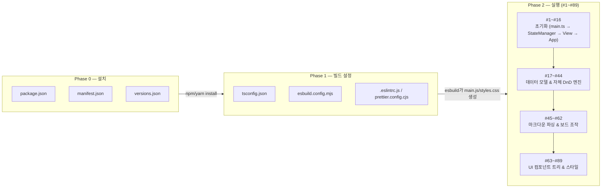

---
tags:
  - obsidian-plugin
  - developer-doc
  - execution-order
---

# Obsidian Kanban Plugin — 설치·설정·실행 순서 문서

> [!info] 이 문서는
> [[project description.md]](구조/역할 중심 개요)의 **보완 문서**입니다. 이 문서는 "이 플러그인이 설치되고, 빌드 설정되고, 실제로 실행되기까지" 관여하는 **모든 핵심 파일에 번호를 매겨** 그 순서를 추적합니다. 소스 파일 89개(핵심 플러그인 로직, flatpickr 벤더 라이브러리·언어별 번역 파일 제외) 각각의 파일 맨 위에는 이 문서와 동일한 번호 체계로 `[실행 순서 #N]` 배너 주석이 추가되어 있고, 파일 본문 곳곳에도 "무엇을 하는 코드인지"와 "어떤 문법인지"를 함께 설명하는 상세 주석이 달려 있습니다. **즉 이 문서는 지도(map)이고, 각 소스파일 안의 주석은 그 지도 위 각 지점의 상세 설명입니다.**

> [!warning] JSON 파일은 내부에 주석을 달 수 없습니다
> `package.json`, `manifest.json`, `versions.json`은 표준 JSON이라 주석을 넣으면 파싱 에러가 납니다(npm/Obsidian이 이 파일을 읽다가 즉시 실패). 그래서 이 세 파일은 **코드를 건드리지 않고, 아래 [[#Phase 0 — 설치]] 절에서 내용을 설명하는 방식**으로 대신했습니다. 반면 `tsconfig.json`은 TypeScript가 JSONC(주석 허용 JSON)로 관대하게 파싱하므로 내부에 `//` 주석을 추가했습니다.

## 목차

- [[#전체 그림]]
- [[#Phase 0 — 설치]]
- [[#Phase 1 — 빌드 설정]]
- [[#Phase 2 — 실행 (번호 1~89)]]
- [[#번호로 보는 전체 파일 표]]
- [[#시나리오별로 따라가 보기]]
- [[#소스코드 주석 규칙]]

---

## 전체 그림



- **Phase 0(설치)**: 사용자가 `npm install`(또는 Obsidian 커뮤니티 플러그인 마켓에서 설치)할 때 관여하는 메타데이터 파일들.
- **Phase 1(빌드 설정)**: 개발자가 `src/`의 TypeScript/Less 코드를 실제로 Obsidian이 읽을 수 있는 `main.js`/`styles.css`로 컴파일하기 위한 설정 파일들.
- **Phase 2(실행)**: Obsidian이 빌드 산출물을 로드한 순간부터 사용자가 카드를 만들고 드래그하고 저장하기까지, 실제로 호출되는 89개 핵심 소스 파일. 이 문서의 핵심 부분입니다.

---

## Phase 0 — 설치

| 파일 | 포맷 | 역할 | 주석 여부 |
|---|---|---|---|
| `package.json` | JSON | 의존성 목록과 npm 스크립트(`dev`/`build`/`lint`...) 정의. 여기서 `"react": "npm:@preact/compat"`, `"react-dom": "npm:@preact/compat"`으로 alias를 걸어두는 것이 이 프로젝트의 가장 중요한 트릭입니다 — 코드는 React API를 그대로 쓰지만 실제 설치되는 건 Preact입니다. | 불가(순수 JSON) — 이 문서에서 설명 |
| `manifest.json` | JSON | Obsidian이 플러그인을 인식하기 위한 메타데이터(`id`, `name`, `version`, `minAppVersion`, `main.js`가 엔트리라는 것 등). 사용자가 커뮤니티 플러그인을 설치/활성화할 때 Obsidian이 가장 먼저 읽는 파일입니다. | 불가 — 이 문서에서 설명 |
| `versions.json` | JSON | 플러그인 버전별로 필요한 Obsidian 최소 버전을 기록. `yarn bump` 시 `version-bump.mjs`가 자동 갱신합니다. | 불가 — 이 문서에서 설명 |

---

## Phase 1 — 빌드 설정

| 파일 | 역할 | 주석 여부 |
|---|---|---|
| `tsconfig.json` | TypeScript 컴파일러 설정. `jsxImportSource: preact`와 `paths`의 react/react-dom alias로 "Preact를 React 타입으로 착각하게" 만듭니다. `yarn typecheck`(`tsc --noemit`)가 이 설정으로 타입만 검사합니다(번들링은 하지 않음). | 완료 — 옵션별 상세 주석 추가 |
| `esbuild.config.mjs` | 실제 번들러 스크립트. `src/main.ts`와 `src/styles.less`를 엔트리포인트로 삼아 `main.js`/`styles.css`를 저장소 루트에 생성합니다. Node 전용 모듈 폴리필, 팝아웃 창을 위한 `setTimeout→activeWindow.setTimeout` 치환 등 커스텀 플러그인이 들어 있습니다. | 완료 — 각 플러그인/옵션별 상세 주석 추가 |
| `.eslintrc.js` | 정적 분석(린트) 규칙. `yarn lint`가 사용. | 완료 — 규칙별 상세 주석 추가 |
| `prettier.config.cjs` | 코드 자동 포맷 규칙(들여쓰기, 따옴표, import 정렬 등). 저장 시 VSCode가 자동 적용. | 완료 — 옵션별 상세 주석 추가 |

> [!tip] 이 저장소 자체가 테스트 vault의 플러그인 폴더
> 이 프로젝트 경로가 `.../plugin_dev_playground/.obsidian/plugins/obsidian-kanban`인 것에서 알 수 있듯, `yarn dev`(watch 모드)를 켜두고 소스를 고치면 esbuild가 즉시 `main.js`/`styles.css`를 재생성합니다. Obsidian에서 "Reload app without saving"으로 반영해 확인합니다. 자세한 내용은 [[project description.md#3. 개발 환경 설정 (빌드·실행)]] 참고.

---

## Phase 2 — 실행 (번호 1~89)

Obsidian이 `manifest.json`을 읽고 `main.js`(=esbuild가 컴파일한 `src/main.ts` 이하 전체)를 로드하는 순간부터 시작됩니다. 89개 파일을 6개의 하위 흐름으로 묶어 설명합니다. **각 번호는 해당 소스파일 최상단의 `[실행 순서 #N]` 배너 주석과 정확히 일치합니다.**

### 2-1. 플러그인 초기화 (#1 ~ #16)

Obsidian 프로세스가 켜지고 이 플러그인이 활성화되는 순간부터, 사용자가 실제로 칸반 파일을 열어 화면에 보드가 뜨기까지의 흐름입니다.

1. **#1 `src/main.ts`** — Obsidian이 로드하는 진입점. `KanbanPlugin.onload()`가 실행되며 이후 모든 것이 여기서부터 파생됩니다.
2. **#2 `src/lang/helpers.ts`** — 번역 함수 `t()`. `main.ts`를 포함해 거의 모든 UI 코드가 이걸 가장 먼저 import해서 씁니다.
3. **#3 `src/types.d.ts`** — Preact를 React처럼 쓰기 위한 전역 타입 보강. 특정 파일이 import하는 게 아니라 TypeScript 컴파일러가 프로젝트 전체에 암묵적으로 적용합니다.
4. **#4 `src/parsers/common.ts`** — `frontmatterKey`('kanban-plugin') 상수 등 파서·설정 공용 유틸. `main.ts`의 `newKanban()`(새 보드 생성)이 여기의 `basicFrontmatter`를 사용합니다.
5. **#5 `src/Settings.ts`** — 전역 설정탭/보드별 설정 모달. `main.ts`의 `onload()`가 `KanbanSettingsTab`을 등록합니다.
6. **#6 `src/settingHelpers.ts`**, **#7 `settings/MetadataSettings.tsx`**, **#8 `settings/TagColorSettings.tsx`**, **#9 `settings/TagSortSettings.tsx`**, **#10 `settings/DateColorSettings.tsx`** — `#5`의 설정 UI가 사용하는 하위 렌더 함수들.
7. **#11 `src/components/Editor/suggest.ts`** — `main.ts`의 `onload()`가 `registerEditorSuggest()`로 등록하는 날짜/시간 자동완성.
8. **#12 `src/dnd/util/getWindow.ts`** — 멀티윈도우(팝아웃) 지원을 위해 DOM 노드의 실제 Window를 찾는 유틸. 이후 dnd 시스템 전체가 사용.
9. **#13 `src/helpers.ts`**(최상위) — frontmatter 키 검사 등. `main.ts`의 이벤트 등록에서 사용.
10. **#14 `src/StateManager.ts`** — 파일(보드) 하나당 하나씩 생성되는 상태 저장소. `main.ts`의 `addView()`가 생성합니다.
11. **#15 `src/KanbanView.tsx`** — 사용자가 칸반 파일을 열면 Obsidian이 생성하는 뷰. `#14`를 통해 데이터를 읽고 씁니다.
12. **#16 `src/DragDropApp.tsx`** — 창(Window)당 하나 마운트되는 최상위 Preact 앱. `#15`의 모든 인스턴스를 포탈로 이식하고 전역 드롭 핸들러를 정의.

> [!note] 이 시점에서 화면에는 아직 "빈 로딩 상태"만 있습니다. 실제 보드 UI가 그려지려면 2-2, 2-4가 필요합니다.

### 2-2. 핵심 데이터 모델 (#17 ~ #23)

- **#17 `components/Kanban.tsx`** — 보드 최상위 컴포넌트. `#15`의 `getPortal()`이 렌더.
- **#18 `components/context.ts`** — `KanbanContext`/`SearchContext`/`SortContext` 등 Preact Context.
- **#19 `components/types.ts`** — `Board`/`Lane`/`Item` 등 **이 플러그인의 핵심 데이터 모델**.
- **#20 `components/helpers.ts`** — `c()`(CSS 클래스 헬퍼) 등 컴포넌트 공용 함수.
- **#21~#22 `components/Icon/*.tsx`** — 아이콘 컴포넌트.
- **#23 `dnd/types.ts`** — `Nestable<D,T>`(Board/Lane/Item 트리의 기반 타입), `Entity`, `Path` 등 DnD 시스템 전역 타입.

### 2-3. 자체 구현 Drag & Drop 엔진 (#24 ~ #44)

react-beautiful-dnd 같은 외부 라이브러리 없이 자체 구현한 이유는 Preact 호환성과 Obsidian의 멀티윈도우(팝아웃 창 간 드래그) 지원 때문입니다.

- **#24~#26 매니저 1차**: `DndManager.ts`(창 단위 컨텍스트), `EntityManager.ts`(엔티티 등록), `ScrollStateManager.ts`(스크롤 상태 추적)
- **#27~#29 매니저 2차**: `ScrollManager.ts`(자동 스크롤), `SortManager.ts`(정렬 순서 계산), `DragManager.ts`(포인터 이벤트 처리 — 엔진의 심장부)
- **#30~#34 유틸**: `data.ts`(Path 기반 Board 트리 조작의 핵심), `hitbox.ts`(좌표 충돌 계산), `animation.ts`, `createHTMLDndEntity.ts`(HTML5 네이티브 드래그), `path.ts`
- **#35~#44 컴포넌트**: `context.ts`, `DndContext.tsx`, `Scope.tsx`, `ScrollContainer.tsx`, `ScrollStateContext.tsx`, `Scrollable.tsx`, `Sortable.tsx`, `SortPlaceholder.tsx`, `Droppable.tsx`, `DragOverlay.tsx`

### 2-4. 마크다운 ↔ 보드 변환 (파싱) (#45 ~ #62)

- **#45 `parsers/parseMarkdown.ts`** — frontmatter/설정 코드블록 추출 + mdast AST 생성.
- **#46~#52 `parsers/extensions/*`** — 표준 마크다운에 없는 칸반 전용 문법(날짜/시간 트리거, #태그, ^블록id, GFM 체크박스, 내부 링크)을 위한 커스텀 micromark 확장 7개.
- **#53~#56 `parsers/helpers/*`** — `ast.ts`(AST 순회), `parser.ts`(FileAccessor 등), `inlineMetadata.ts`(인라인 필드·완료 토글), `hydrateBoard.ts`(파싱 후처리).
- **#57 `parsers/formats/list.ts`** — AST↔Board 실제 변환 로직(`astToUnhydratedBoard`/`boardToMd`).
- **#58 `parsers/List.ts`** — 위 모두를 감싸는 `ListFormat` 클래스. diff/patch로 상태를 보존하며 재파싱.
- **#59~#62 `helpers/*`** — `boardModifiers.ts`(보드 조작 API), `patch.ts`(diff/apply), `renderMarkdown.ts`(링크 정규화), `util.ts`(PromiseQueue 등).

### 2-5. UI 컴포넌트 트리 (#63 ~ #88)

- **#63~#68 레인(리스트)**: `Lane.tsx`, `LaneHeader.tsx`, `LaneTitle.tsx`, `LaneForm.tsx`, `LaneMenu.tsx`, `LaneSettings.tsx`
- **#69~#78 카드(아이템)**: `Item.tsx`, `ItemContent.tsx`, `ItemForm.tsx`, `ItemCheckbox.tsx`, `ItemMenu.ts`, `ItemMenuButton.tsx`, `MetadataTable.tsx`, `DateAndTime.tsx`, `InlineMetadata.tsx`, `helpers.ts`
- **#79 `MarkdownRenderer/MarkdownRenderer.tsx`** — 카드 본문을 Obsidian 표준 방식으로 렌더링
- **#80~#83 테이블 보기**: `Table.tsx`, `Cells.tsx`, `helpers.tsx`, `types.ts`
- **#84~#88 인라인 편집기**: `MarkdownEditor.tsx`(CodeMirror6), `dateWidget.ts`, `datepicker.ts`, `datePickerLocale.ts`, `helpers.ts`

### 2-6. 스타일 (#89)

- **#89 `src/styles.less`** — esbuild가 `styles.css`로 컴파일하는 전체 스타일시트. `#20`의 `c()` 헬퍼가 만드는 `kanban-plugin__*` BEM 클래스명 체계를 따릅니다.

---

## 번호로 보는 전체 파일 표

<div style="overflow-x:auto">

| # | 파일 | 단계 |
|---|---|---|
| 1 | `src/main.ts` | 실행-초기화 |
| 2 | `src/lang/helpers.ts` | 실행-초기화 |
| 3 | `src/types.d.ts` | 실행-초기화 |
| 4 | `src/parsers/common.ts` | 실행-초기화 |
| 5 | `src/Settings.ts` | 실행-초기화 |
| 6 | `src/settingHelpers.ts` | 실행-초기화 |
| 7 | `src/settings/MetadataSettings.tsx` | 실행-초기화 |
| 8 | `src/settings/TagColorSettings.tsx` | 실행-초기화 |
| 9 | `src/settings/TagSortSettings.tsx` | 실행-초기화 |
| 10 | `src/settings/DateColorSettings.tsx` | 실행-초기화 |
| 11 | `src/components/Editor/suggest.ts` | 실행-초기화 |
| 12 | `src/dnd/util/getWindow.ts` | 실행-초기화 |
| 13 | `src/helpers.ts` | 실행-초기화 |
| 14 | `src/StateManager.ts` | 실행-초기화 |
| 15 | `src/KanbanView.tsx` | 실행-초기화 |
| 16 | `src/DragDropApp.tsx` | 실행-렌더링 |
| 17 | `src/components/Kanban.tsx` | 실행-렌더링 |
| 18 | `src/components/context.ts` | 실행-렌더링 |
| 19 | `src/components/types.ts` | 실행-렌더링 |
| 20 | `src/components/helpers.ts` | 실행-렌더링 |
| 21 | `src/components/Icon/Icon.tsx` | 실행-렌더링 |
| 22 | `src/components/Icon/GripIcon.tsx` | 실행-렌더링 |
| 23 | `src/dnd/types.ts` | 실행-상호작용 |
| 24 | `src/dnd/managers/DndManager.ts` | 실행-상호작용 |
| 25 | `src/dnd/managers/EntityManager.ts` | 실행-상호작용 |
| 26 | `src/dnd/managers/ScrollStateManager.ts` | 실행-상호작용 |
| 27 | `src/dnd/managers/ScrollManager.ts` | 실행-상호작용 |
| 28 | `src/dnd/managers/SortManager.ts` | 실행-상호작용 |
| 29 | `src/dnd/managers/DragManager.ts` | 실행-상호작용 |
| 30 | `src/dnd/util/data.ts` | 실행-상호작용 |
| 31 | `src/dnd/util/hitbox.ts` | 실행-상호작용 |
| 32 | `src/dnd/util/animation.ts` | 실행-상호작용 |
| 33 | `src/dnd/util/createHTMLDndEntity.ts` | 실행-상호작용 |
| 34 | `src/dnd/util/path.ts` | 실행-상호작용 |
| 35 | `src/dnd/components/context.ts` | 실행-렌더링/상호작용 |
| 36 | `src/dnd/components/DndContext.tsx` | 실행-렌더링/상호작용 |
| 37 | `src/dnd/components/Scope.tsx` | 실행-렌더링/상호작용 |
| 38 | `src/dnd/components/ScrollContainer.tsx` | 실행-렌더링/상호작용 |
| 39 | `src/dnd/components/ScrollStateContext.tsx` | 실행-렌더링/상호작용 |
| 40 | `src/dnd/components/Scrollable.tsx` | 실행-렌더링/상호작용 |
| 41 | `src/dnd/components/Sortable.tsx` | 실행-렌더링/상호작용 |
| 42 | `src/dnd/components/SortPlaceholder.tsx` | 실행-렌더링/상호작용 |
| 43 | `src/dnd/components/Droppable.tsx` | 실행-렌더링/상호작용 |
| 44 | `src/dnd/components/DragOverlay.tsx` | 실행-렌더링/상호작용 |
| 45 | `src/parsers/parseMarkdown.ts` | 실행-파싱 |
| 46 | `src/parsers/extensions/helpers.ts` | 실행-파싱 |
| 47 | `src/parsers/extensions/types.ts` | 실행-파싱 |
| 48 | `src/parsers/extensions/genericWrapped.ts` | 실행-파싱 |
| 49 | `src/parsers/extensions/tag.ts` | 실행-파싱 |
| 50 | `src/parsers/extensions/blockid.ts` | 실행-파싱 |
| 51 | `src/parsers/extensions/taskList.ts` | 실행-파싱 |
| 52 | `src/parsers/extensions/internalMarkdownLink.ts` | 실행-파싱 |
| 53 | `src/parsers/helpers/ast.ts` | 실행-파싱 |
| 54 | `src/parsers/helpers/parser.ts` | 실행-파싱 |
| 55 | `src/parsers/helpers/inlineMetadata.ts` | 실행-파싱 |
| 56 | `src/parsers/helpers/hydrateBoard.ts` | 실행-파싱 |
| 57 | `src/parsers/formats/list.ts` | 실행-파싱 |
| 58 | `src/parsers/List.ts` | 실행-파싱 |
| 59 | `src/helpers/boardModifiers.ts` | 실행-상호작용 |
| 60 | `src/helpers/patch.ts` | 실행-저장·동기화 |
| 61 | `src/helpers/renderMarkdown.ts` | 실행-렌더링 |
| 62 | `src/helpers/util.ts` | 실행-저장·동기화 |
| 63 | `src/components/Lane/Lane.tsx` | 실행-렌더링 |
| 64 | `src/components/Lane/LaneHeader.tsx` | 실행-렌더링 |
| 65 | `src/components/Lane/LaneTitle.tsx` | 실행-상호작용 |
| 66 | `src/components/Lane/LaneForm.tsx` | 실행-상호작용 |
| 67 | `src/components/Lane/LaneMenu.tsx` | 실행-상호작용 |
| 68 | `src/components/Lane/LaneSettings.tsx` | 실행-상호작용 |
| 69 | `src/components/Item/Item.tsx` | 실행-렌더링 |
| 70 | `src/components/Item/ItemContent.tsx` | 실행-렌더링 |
| 71 | `src/components/Item/ItemForm.tsx` | 실행-상호작용 |
| 72 | `src/components/Item/ItemCheckbox.tsx` | 실행-상호작용 |
| 73 | `src/components/Item/ItemMenu.ts` | 실행-상호작용 |
| 74 | `src/components/Item/ItemMenuButton.tsx` | 실행-상호작용 |
| 75 | `src/components/Item/MetadataTable.tsx` | 실행-렌더링 |
| 76 | `src/components/Item/DateAndTime.tsx` | 실행-렌더링 |
| 77 | `src/components/Item/InlineMetadata.tsx` | 실행-렌더링 |
| 78 | `src/components/Item/helpers.ts` | 실행-렌더링 |
| 79 | `src/components/MarkdownRenderer/MarkdownRenderer.tsx` | 실행-렌더링 |
| 80 | `src/components/Table/Table.tsx` | 실행-렌더링 |
| 81 | `src/components/Table/Cells.tsx` | 실행-렌더링 |
| 82 | `src/components/Table/helpers.tsx` | 실행-렌더링 |
| 83 | `src/components/Table/types.ts` | 실행-렌더링 |
| 84 | `src/components/Editor/MarkdownEditor.tsx` | 실행-상호작용 |
| 85 | `src/components/Editor/dateWidget.ts` | 실행-상호작용 |
| 86 | `src/components/Editor/datepicker.ts` | 실행-상호작용 |
| 87 | `src/components/Editor/datePickerLocale.ts` | 실행-상호작용 |
| 88 | `src/components/Editor/helpers.ts` | 실행-상호작용 |
| 89 | `src/styles.less` | 실행-렌더링(스타일) |

</div>

> [!note] 번호는 "엄격한 실행 순서"가 아니라 "논리적 등장 순서"입니다
> 실제로는 많은 파일이 서로를 순환 참조하거나(예: `#17`이 `#59`를 쓰고 `#59`도 `#17`이 만든 Context를 통해 호출됨) 동시에 존재합니다. 이 번호는 "설치→빌드→초기화→데이터모델→DnD엔진→파싱→UI"라는 **레이어 순서**를 사람이 이해하기 쉽게 표현한 것이며, 각 파일 상단의 배너 주석에 "이 파일이 누구를 부르고 누가 이 파일을 부르는지"가 구체적으로 설명되어 있습니다.

---

## 시나리오별로 따라가 보기

### 시나리오 A: Obsidian이 켜지고 플러그인이 활성화될 때

`#1(main.ts) onload()` → 설정 로드 → `#5(Settings.ts)` 설정탭 등록 → 에디터 서제스트(`#11`) 등록 → 뷰 타입(`#15 KanbanView`) 등록 → 몽키패치 등록(WorkspaceLeaf 가로채기) → 커맨드/이벤트 등록 → `#16(DragDropApp.tsx)`을 메인 윈도우에 마운트(아직 열린 보드는 없음) → 리본 아이콘 추가.

### 시나리오 B: 사용자가 `kanban-plugin: board` frontmatter가 있는 파일을 클릭할 때

`#1`의 몽키패치가 뷰 타입을 `kanban`으로 강제 전환 → `#15(KanbanView)` 생성 → `onLoadFile → setViewData` → `#1`의 `addView()` → 파일별 `#14(StateManager)` 생성/재사용 → `#58(List.ts) → #45(parseMarkdown.ts) → #46~52(확장) → #57(formats/list.ts) → #56(hydrateBoard.ts)` 순으로 마크다운이 `Board` 객체로 변환 → `#17(Kanban.tsx)`가 `#63(Lane.tsx)`/`#69(Item.tsx)` 트리로 렌더.

### 시나리오 C: 사용자가 카드를 다른 리스트로 드래그할 때

`#29(DragManager.ts)`가 포인터 이동을 추적 → `#28(SortManager.ts)`가 삽입 위치 계산 → 드롭 시 `#16(DragDropApp.tsx)`의 `handleDrop` → `#30(dnd/util/data.ts)`의 `moveEntity` → `#14(StateManager.setState)` → 구독 중인 `#17` 이하 컴포넌트 리렌더 + `#58(List.ts)`의 `boardToMd`로 직렬화 → 디스크 저장.

### 시나리오 D: 다른 곳에서 파일이 외부 수정되었을 때

`#1`이 구독해둔 `vault.modify`/`metadataCache changed` 이벤트 → `#14(StateManager).onFileMetadataChange()` → `reparseBoardFromMd()` → `#58(List.ts).mdToBoard()`가 `#60(helpers/patch.ts)`의 diff로 기존 상태(접힘 상태 등)를 보존하며 재동기화.

---

## 소스코드 주석 규칙

각 소스파일 최상단에는 다음과 같은 형식의 배너 주석이 있습니다(이 문서의 번호 체계와 100% 동일):

```ts
/**
 * ============================================================================
 * [실행 순서 #N] 파일명 — 역할 한 줄 요약
 * ----------------------------------------------------------------------------
 * 단계: 실행-초기화 | 실행-렌더링 | 실행-파싱 | 실행-상호작용 | 실행-저장·동기화
 * (이 파일이 언제 왜 로드/호출되는지, 어떤 파일과 연결되는지에 대한 3~6문장 설명)
 * ============================================================================
 */
```

파일 본문 전체에는 각 선언/블록마다 (a) **기능 설명**(이 코드가 실제로 무엇을 하는지)과 (b) **문법 설명**(TypeScript/Preact/Obsidian API/서드파티 라이브러리의 어떤 문법을 쓰고 있는지 — 제네릭, 옵셔널체이닝, `immutability-helper`의 `$set`/`$push` 스펙, Preact 훅과 의존성 배열, `eventemitter3`의 `on`/`off`/`emit`, `async`/`await` 등)을 함께 설명하는 한국어 주석이 달려 있습니다. 코드의 실행 로직·포맷 자체는 변경하지 않았습니다(순수 주석 추가).

> [!tip] 코드를 읽는 순서
> 처음 이 코드베이스를 보는 사람은 이 문서의 [[#번호로 보는 전체 파일 표]]를 따라 `#1`부터 순서대로 파일을 열어보되, 각 파일에서는 파일 상단 배너 주석 → 본문 상세 주석 순으로 읽으면 "왜 이 파일이 여기 있고, 무슨 문법으로 무엇을 하는지"를 함께 파악할 수 있습니다.
